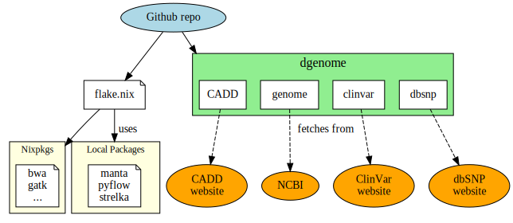

# Reference

## Packaging with Nix

Nix stores every package is a dedicated folder `/nix/store`. Each package (*derivation*) is defined in an unique way according to the source code (checksum) and all of its derivations. If one of this parameters change, another version is created. This allow to have multiple version in parallel, and better reproducibility. While we strive to be fully reproducible by fixing all *inputs* of a package, there may be some cases where reproducibility "to the byte" cannot (yet) be achieved.

A package is defined by a single configuration files, `default.nix` in our repository. Most of the packages are on `nixpkgs`, the central repository for all nix packages. We had to create or improve several packages and contributions have been upstreamed to nixpkgs. To improve reproducibility, another configuration file, `flake.nix` define the nixpkgs version and the list of packages.

In short, a few configuration files uniquely define all the packages. Ideally, all packages should be on nixpkgs but some of them depends on Python 2, whose support have been removed from nixpkgs.

### Conflict between strelka and dragmap

Strelka and dragmap install files with the same name in `/lib/python`, `/libexec` if installed globally. This is an issue when we try to make both of them available. As a workaround, strelka installation directory was modified to have as a subfolder
strelka containing everything except bin.

### Database with Datalad

`Git-annex` allows to manage large files with git across multiple locations. [Datalad](https://handbook.datalad.org/en/latest/intro/philosophy.html) make this approach more user-friendly.
The basic principle in our configuration is that [each dataset has its own git repository. A [master repository](https://github.com/apraga/dgenomes) lists all datasets and keep them in sync.
No data is stored in the git repository in itself, only its location on the web and its checksum. When cloning the repository, no data is download yet, only symlink to a local folder are created. Data is downloaded upon the user request with a single command.

It enables easier update and data reutilisation. As we closely follow-up upstream sources, recent version.
 Thanks to git, it's also easy to switch between minor or major version. Finally, it can be adapted to local databases if needed. A [thorough guide](https://handbook.datalad.org/en/latest/) is available on datalad website. Work is underway to contribute our datasets to Datalad collection.

## Tests

Each change to the github repository on the `main` branch ensure

1. All package builds. To decrease compilation times, a cache with cachix is used but any change to a package or its depedencies will cause a rebuild.
2. A small but clinically relevant test case is run to ensure 2 mutations (SNVs) and a deletion (CNV) are aligned and called properly.
3. Most packages include tests, either functional or unitary. Those tests are run by nix when creating the package.
4. Annotation is much harder to set as databases often changes leading often to different functional annotations. Also, `vep` cache is too big for Github CI. We only test `snpeff` and ensure no variants are lost after annotation and there is an annotation field.

`CNVKit` is not tested in our minimal testing as [it is less accurate in detecting CNVs smaller than 1 Mbp](https://cnvkit.readthedocs.io/en/stable/germline.html). Also, we did not use sarek testing suite for several reasons. First, its minimal testing does not include germline data. Second, it compare the checksum of output files, that can change due to different software versions. We chose to use a more clinically relevant invariant where only variants are checked. If metadata differs due to an updgrade, test will still pass.

## Limits

Currently, there are few limits to our approach.

- on Github CI, nextflow version does not run at all. This has not been reproduced on other machines and architectures. This package has been used in production on our cluster without issue. Current Github CI use upstream nextflow version for the moment. This is the only package not in Nix in our tests.
- By default, Sarek filters variants with GATK haplotypecaller using a [convolutional neural network](https://gatk.broadinstitute.org/hc/en-us/articles/360037226672-CNNScoreVariants). This has not yet been packaged in Nix so this step must be skipped in Sarek. The command-line examples in the tutorial reflect that.
- Database only follows upstream conventions, so some manual intervention is needed to extract the archives [and rename the chromosomes](./tutorial.md#downloading-all-databases).

For the first two issues, [contributions](./contributing.md) are welcome !
